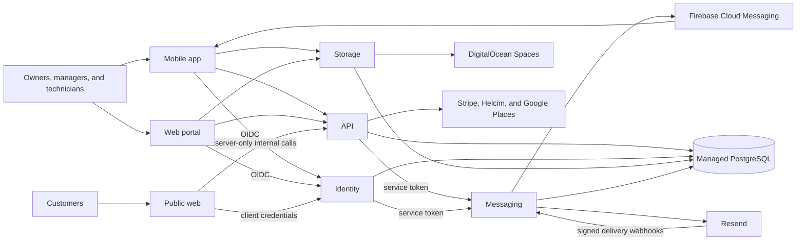

# Architecture Overview

TiniTasker is a service-oriented SaaS platform for Canadian service businesses. This page describes the runtime relationships at a high level; product rules and cross-repository contracts remain in the rest of the [engineering handbook](README.md).

## Runtime components

| Component           | Primary responsibility                                         | Main communication paths                                                               |
|---------------------|----------------------------------------------------------------|----------------------------------------------------------------------------------------|
| `app`               | Mobile experience for owners and technicians.                  | OIDC with Identity; product API and authorized Storage attachment operations.          |
| `web-portal`        | Internal browser dashboard for owners and managers.            | OIDC with Identity; product API and authorized Storage attachment operations.          |
| `web-public`        | Marketing site and public estimate/invoice experience.         | Server-side client credentials with Identity; server-only internal API calls.          |
| `identity`          | OpenID Connect, account authentication, and token issuance.    | PostgreSQL; service-token calls to Messaging for account and invitation communication. |
| `api`               | Product-domain APIs and authoritative business calculations.   | PostgreSQL; service-token calls to Messaging; Stripe, Helcim, and Google Places.       |
| `storage`           | Private, organization-scoped attachment storage.               | PostgreSQL metadata and DigitalOcean Spaces objects.                                   |
| `messaging`         | Email/push validation, queueing, delivery, and audit behavior. | PostgreSQL; Resend delivery/webhooks and Firebase Cloud Messaging.                     |
| `actions`           | Versioned shared GitHub Actions primitives.                    | Consumed by repository CI workflows using full immutable commit SHAs.                  |
| `migrations-runner` | Validated PostgreSQL migration packaging and execution image.  | Used by service delivery through `actions`, as a digest-pinned GHCR image.             |
| `infrastructure`    | DigitalOcean Terraform definitions and delivery prerequisites. | App Platform, managed PostgreSQL, Spaces, domains, firewalls, and restricted runners.  |

## Data and trust boundaries

- API, Identity, Storage, and Messaging use a shared managed PostgreSQL cluster with separate `public`, `identity`, `storage`, and `messaging` schemas.
- Every service applies organization-scoped authorization. Storage objects are private; entity-level authorization remains with the API.
- Browser and mobile clients receive only the tokens and public configuration appropriate to their role. The public web application's service credentials remain server-only.
- Messaging validates service access before delivery. Resend delivery webhooks are signed and return to Messaging; Firebase Cloud Messaging reaches registered mobile clients.

## Delivery and operations

- `infrastructure` provisions the DigitalOcean estate. Backend services are deployed as immutable GHCR images; the web portal is a source-built static site, and public web is a source-built Docker service.
- Service workflows use shared `actions` and the digest-pinned `migrations-runner` image to validate and execute PostgreSQL migration bundles on a restricted self-hosted runner.
- Pull requests validate changes without deployment secrets. Merged `main` commits deliver staging changes where configured; production delivery is explicitly controlled by each repository's documented workflow.
- Better Stack receives backend log output where configured. Secrets, Terraform state, credentials, and customer data never belong in source control or documentation.
